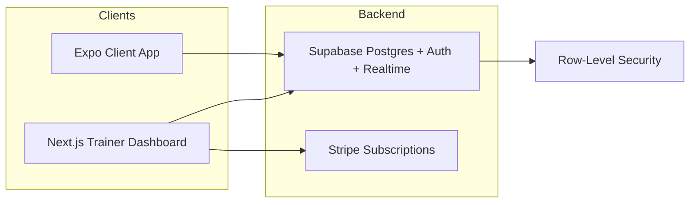

# CoachFlow: Web (Trainers) + Mobile (Clients) — Build Plan

This plan merges the technical execution from [Readme.md](Readme.md) with the product scope from [Plan.md](Plan.md). CoachFlow is a **Trainer OS**—one place for workout programming, client tracking, messaging, and payments.

---

## Product decisions (locked for MVP)

- **Client onboarding:** Trainer sends **email invite**; client gets a link that opens **signup/register on the mobile app** and is linked to that trainer. No web signup for clients in MVP; no “link existing account.”
- **Payments:** **Trainer-only** — trainer pays CoachFlow (SaaS subscription). Client-pays-trainer is post-MVP.
- **Progress photos:** **In MVP** — client can upload progress photos; trainer sees photo timeline (add in Phase 5 or dedicated phase).
- **Trainer experience:** **Web only** — no trainer mobile app for MVP.

---

## Target outcomes

| Side | Platform | Primary users |
|------|----------|----------------|
| **Trainer Dashboard** | Web (Next.js) | Independent trainers, online/hybrid coaches (5–75 clients) |
| **Client App** | Mobile (Expo) | End clients who train with a coach |

**Shared:** Single Supabase backend, Stripe subscriptions, realtime messaging.

---

## Architecture

**Stack (locked):**
- **Web:** Next.js (App Router), TailwindCSS, ShadCN UI
- **Mobile:** React Native (Expo)
- **Backend:** Supabase (Postgres, Auth, Realtime), RLS
- **Payments:** Stripe subscriptions + webhook
- **Hosting:** Vercel (web), Expo EAS (mobile)

---

## Database schema (lock early)

- **users:** `id`, `role` (trainer | client), `name`, `email` (Supabase Auth + profile row or extended via `profiles`)
- **trainers:** `user_id` (FK), `business_name`, `subscription_plan`, `stripe_customer_id` (optional, for Phase 6)
- **clients:** `user_id` (FK), `trainer_id` (FK), `status`, `start_date`
- **client_invites:** `id`, `trainer_id`, `email`, `token`, `expires_at`, `created_at` (for email-invite flow; Phase 3)
- **workouts:** `id`, `trainer_id`, `title`, `exercises` (JSON)
- **workout_assignments:** `workout_id`, `client_id`, `week_start`
- **workout_logs:** `client_id`, `exercise_name`, `reps`, `weight`, `completed_at` (optionally `workout_id` or `assignment_id` for grouping)
- **progress_photos:** `id`, `client_id`, `uploaded_at`, `storage_path` (Supabase Storage URL), optional `caption` (Phase 5b)
- **messages:** (Phase 7) e.g. `id`, `trainer_id`, `client_id`, `sender_id`, `body`, `created_at` — thread = (trainer_id, client_id)

**Storage:** Supabase Storage bucket for progress photos (private; RLS so client uploads own, trainer reads their clients’).

Payments: Stripe subscription + webhook to sync plan; lock dashboard when inactive. No client billing in MVP.

---

## Phase 1 — Project setup

**Objective:** Monorepo with web app, mobile app, and shared API layer. Both apps can talk to Supabase.

**Review notes:**
- Use Turborepo so builds and types stay in sync; avoid duplicating Supabase client logic.
- Shared package should export types and Supabase client factory (or config), not business logic.
- Env handling: one `.env.example` at root listing all keys; each app reads its own env at runtime.

**Cursor prompt (suggested):**
> Create a monorepo using Turborepo with: (1) Next.js 14+ app in `apps/web` with App Router and Tailwind, (2) Expo React Native app in `apps/mobile`, (3) shared TypeScript package in `packages/api-types` that exports shared types and Supabase client helpers. Set up Supabase client in both apps using the shared package. Add a root `.env.example` documenting `NEXT_PUBLIC_SUPABASE_URL`, `NEXT_PUBLIC_SUPABASE_ANON_KEY`, and any mobile equivalents.

**Deliverables:**
- [ ] Monorepo: `apps/web`, `apps/mobile`, `packages/api-types`
- [ ] Supabase client working in web and mobile
- [ ] Env documented and loaded in both apps

**Dependencies:** None. Do this first.

**Schema timing:** Before Phase 2, create the Supabase project and run an **initial migration** that creates all core tables (`profiles`/users extension, `trainers`, `clients`, `workouts`, `workout_assignments`, `workout_logs`) and enables RLS with minimal policies. Add `client_invites` and `progress_photos` in the phases that use them (3 and 5b). Keep migrations in versioned SQL (e.g. `supabase/migrations/`) and never change schema ad-hoc.

---

## Phase 2 — Authentication and role system

**Objective:** Email/password auth via Supabase. Users have a role (trainer | client). Trainers land on dashboard; clients on client home. Routes are protected by role.

**Review notes:**
- Role must live in DB (e.g. `users.role` or `profiles.role`), set on signup or first login, and read after auth to decide redirect.
- Web: middleware or layout checks role and redirects (e.g. trainer → `/dashboard`, client → `/client/home`). Consider a role in session/JWT or a quick DB lookup after `getSession()`.
- Mobile: same idea—after login, fetch role and navigate to trainer vs client root screen. Store session via Supabase auth.
- Do not allow trainers to access client-only routes or vice versa.

**Cursor prompt (suggested):**
> Implement Supabase email/password authentication. Add a `role` column (trainer | client) to the user profile and set it at signup. Create role-based routing: trainers redirect to `/dashboard`, clients to `/client/home`. Add protected route logic so unauthenticated users go to login and authenticated users are redirected by role. Implement the same role check and navigation in the Expo app after login.

**Deliverables:**
- [x] Sign up / sign in (web + mobile)
- [x] Role stored and used for redirects
- [x] Protected routes and role middleware (web and mobile)

**Dependencies:** Phase 1. Supabase project and Auth enabled.

---

## Phase 3 — Trainer dashboard core (Web)

**Objective:** Trainers can add, list, edit, and delete clients. **Add client = email invite:** trainer enters email, system sends invite link; client signs up via link and is linked to that trainer. All data scoped to the logged-in trainer.

**Review notes:**
- RLS is critical: policies on `clients` and `client_invites` must use `auth.uid()` and `trainer_id`. Test with two trainer accounts.
- **Invite flow:** (1) Trainer enters client email → create row in `client_invites` (trainer_id, email, unique token, expires_at). (2) Send email with link that opens the **mobile app** (e.g. deep link `coachflow://invite?token=...` or universal link so mobile opens app for signup). (3) Client opens link on phone → mobile app signup/register screen (email pre-filled from invite); on signup create `users`/profile with role=client and `clients` row (user_id, trainer_id); mark invite used or delete. If link is opened on desktop, show “open on your phone” or redirect to app store. Use a simple email sender (e.g. Resend, SendGrid) or dev-only “log link to console” for MVP.
- UI: client list page, “Invite client” (email input + send), edit client, delete with confirmation. Use ShadCN.

**Cursor prompt (suggested):**
> Create client management for trainers: list clients, invite client by email (create `client_invites` row with token, send email with link that opens the **mobile app** for signup). Edit client, delete client. Invite link is a deep link / universal link to the Expo app; client signs up on mobile (email pre-filled), creating user (role=client) and `clients` row linked to trainer. Enforce RLS on `clients` and `client_invites`. Use ShadCN. Test that trainer A cannot see or modify trainer B’s clients or invites.

**Deliverables:**
- [x] Client list, invite client (email + invite link), edit client, delete client (web)
- [x] `client_invites` table + invite flow (email with link that opens **mobile app** for signup; client registers on mobile, linked to trainer)
- [x] Client detail page (for later use by progress photos and messaging)
- [x] RLS on `clients` and `client_invites` (invite validate/accept via API with service role where needed)

**Dependencies:** Phase 2. Tables `users`, `trainers`, `clients` exist; add `client_invites` in this phase.

---

## Phase 4 — Workout builder (Web)

**Objective:** Trainers create reusable workout templates (title + list of exercises), duplicate them, and assign a workout to a client (e.g. by week).

**Review notes:**
- Exercises stored as JSON in `workouts` is fine for MVP (e.g. array of `{ name, sets, reps, weight_optional }`). Keep schema in the shared types package.
- UI: “Create workout” → add exercises (name, sets, reps, maybe notes). Drag-and-drop or add/remove rows. Save as template. “Duplicate” copies a workout. “Assign to client” picks client + week_start and creates a row in `workout_assignments`.
- Clarify assignment semantics: one assignment per (workout, client, week) or one per (client, week) with one workout. Plan says “assign workout to client” with `week_start`—so one row per assignment, multiple assignments per client over time.

**Cursor prompt (suggested):**
> Build the workout template system: (1) Create workout with title and exercises (exercise name, sets, reps; store as JSON array). (2) UI to add/remove/reorder exercises. (3) Duplicate workout. (4) Assign workout to a client with a week start date, writing to `workout_assignments`. Use ShadCN. Enforce RLS so trainers only manage their own workouts and assignments.

**Deliverables:**
- [ ] Create/edit workout templates with exercise list (JSON)
- [ ] Duplicate workout
- [ ] Assign workout to client (with week_start)
- [ ] RLS for `workouts` and `workout_assignments`

**Dependencies:** Phase 3. Tables `workouts`, `workout_assignments` exist.

---

## Phase 5 — Client mobile features

**Objective:** Clients see their assigned workouts, log sets/reps/weight per exercise, and see past workout history.

**Review notes:**
- Mobile fetches assignments for the client (and joined workout details). Show current/upcoming and past.
- Logging: for each exercise in a workout, allow entering reps/weight (and maybe “completed”). Insert into `workout_logs` with `client_id`, `exercise_name`, `reps`, `weight`, `completed_at`. RLS: clients can only insert/read their own logs.
- History: list or calendar of past logs, optionally with simple stats (e.g. last weight per exercise).

**Cursor prompt (suggested):**
> In the Expo app, for the client role: (1) Fetch assigned workouts for the logged-in client (from `workout_assignments` + `workouts`). (2) Display exercise list for a selected workout. (3) Allow logging reps/weight per exercise and save to `workout_logs`. (4) Show previous workout history (past logs). Enforce RLS so clients only see their own assignments and logs.

**Deliverables:**
- [ ] Client sees assigned workouts and exercises
- [ ] Log reps/weight and submit to `workout_logs`
- [ ] Workout history view

**Dependencies:** Phase 4. Table `workout_logs` and RLS in place.

---

## Phase 5b — Progress photos (MVP)

**Objective:** Clients upload progress photos; trainers see a photo timeline per client. Stored in Supabase Storage with RLS.

**Review notes:**
- **Storage:** One bucket (e.g. `progress-photos`), path like `{client_id}/{uploaded_at or id}.jpg`. RLS: client can INSERT for own `client_id`; trainer can SELECT for their clients.
- **Table:** `progress_photos` with `client_id`, `storage_path`, `uploaded_at`, optional `caption`. Client uploads from mobile (camera or gallery); trainer sees timeline on client detail (web).
- **UI (mobile):** “Add progress photo” → pick/capture image → upload → show in list or timeline. **UI (web):** On client detail page, show photos in date order (newest first or timeline slider).

**Cursor prompt (suggested):**
> Add progress photos: (1) Supabase Storage bucket with RLS (client upload own, trainer read their clients). (2) `progress_photos` table (client_id, storage_path, uploaded_at). (3) Mobile: client can take/select photo and upload. (4) Web: trainer sees photo timeline on client detail page. Optional: caption, simple timeline or list view.

**Deliverables:**
- [ ] Storage bucket + RLS; `progress_photos` table
- [ ] Mobile: upload progress photo
- [ ] Web: trainer sees client photo timeline

**Dependencies:** Phase 3 (client detail page), Phase 5 (client app). Can run after Phase 5.

---

## Phase 6 — Stripe subscription integration

**Objective:** Trainers subscribe monthly (tiers from Plan.md). Webhook updates `trainer.subscription_plan`. Dashboard is locked or limited when subscription is inactive or past due.

**Review notes:**
- Stripe: create Products/Prices for tiers (e.g. Starter $29, Growth $59, Pro $99). Use Checkout or Customer Portal for subscription. 14-day trial can be configured in Stripe.
- Webhook: Next.js API route (e.g. `api/webhooks/stripe`) that verifies signature and handles `customer.subscription.updated` / `created` / `deleted` (and optionally `invoice.payment_failed`). Update `trainers.subscription_plan` and maybe `subscription_status`.
- Dashboard: after auth, check trainer’s subscription; if inactive or missing, show paywall or limited UI and link to checkout. Never expose payment keys in client; use server or Stripe server-side only for webhook.

**Cursor prompt (suggested):**
> Integrate Stripe subscription checkout for trainers. Create Products/Prices for tiers (e.g. $29 / $59 / $99) and optional 14-day trial. Add a Next.js webhook route that verifies Stripe signature and on subscription events updates the trainer’s `subscription_plan` (and status) in Supabase. In the trainer dashboard, check subscription status and lock or limit access if inactive; show paywall and link to checkout.

**Deliverables:**
- [ ] Stripe checkout (or portal) for trainer subscription
- [ ] Webhook updates trainer plan/status
- [ ] Dashboard enforces active subscription

**Dependencies:** Phase 3. Stripe account and webhook secret. Review all Stripe code manually.

---

## Phase 7 — Messaging

**Objective:** Trainer–client in-app messaging. One thread per client. Realtime updates on web and mobile.

**Review notes:**
- Schema: e.g. `messages` with `id`, `thread_id` (or trainer_id + client_id), `sender_id`, `body`, `created_at`. Thread can be implied by (trainer_id, client_id).
- Supabase Realtime: subscribe to new rows in `messages` for the current thread. Both sides insert with sender = current user; RLS allows trainer to see threads with their clients, clients to see only their thread with their trainer.
- UI: trainer sees list of clients, picks one → thread view. Client sees single thread with trainer. Input + send; new messages appear via Realtime.

**Cursor prompt (suggested):**
> Implement trainer–client messaging. Add `messages` table (e.g. thread identifier, sender_id, body, created_at) and RLS so trainer sees only their client threads and clients see only their trainer thread. Use Supabase Realtime to subscribe to new messages in the current thread. Build thread list and thread view in the web dashboard and a single thread view in the mobile app.

**Deliverables:**
- [ ] Messages table and RLS
- [ ] Realtime subscription for active thread
- [ ] Chat UI on web (trainer) and mobile (client)

**Dependencies:** Phase 2 (auth), Phase 3 (client list for trainer). Optional to do after Phase 6.

---

## Optional Phase 8 — Weekly check-ins

**Objective:** Trainers define weekly check-in questions. Clients submit answers. Trainers see a summary (e.g. weight, mood, sleep, adherence, wins/struggles).

**Review notes:**
- Schema: e.g. `check_in_questions` (trainer_id, question_key, label, order), `check_in_responses` (client_id, week_start, responses JSON, submitted_at).
- Trainer UI: simple form to add/edit/order questions. Client UI (mobile): once per week, form with those questions; submit creates/updates response. Dashboard: list clients with last submission and summary view (table or cards).

**Cursor prompt (suggested):**
> Add weekly check-in: (1) Trainer can define and reorder questions (e.g. weight, mood, sleep, nutrition adherence, wins/struggles). (2) Client sees a weekly form and submits answers. (3) Trainer dashboard shows summary of check-ins (per client, per week). Store questions and responses in Supabase with RLS.

**Deliverables:**
- [ ] Trainer: define check-in questions
- [ ] Client: submit weekly check-in
- [ ] Trainer: check-in summary dashboard

**Dependencies:** Phase 3, Phase 5. Best after core flows are stable.

---

## Scope alignment with Plan.md

- **Trainer dashboard:** Clients + invite (3), templates + assign (4), payments (6), messaging (7), progress photos (5b), check-ins (8 optional).
- **Client app:** Workouts + logging (5), progress photos (5b), messaging (7). No client payment in MVP.
- **Progress visualization:** Photo timeline in MVP (5b). Weight graph, PRs, body measurements — post-MVP enhancements.
- **Pricing:** Tiers and 14-day trial in Phase 6 (Stripe + webhook); trainer-only.

---

## Guardrails

- Do not build the entire app in one prompt; execute one phase at a time.
- Lock database schema early; change only via explicit migrations.
- Version control strictly; review all Stripe and RLS code manually.
- Test RLS with multiple users (e.g. two trainers, two clients) to ensure isolation.

---

## Testing and migrations

- **Migrations:** All schema changes in versioned SQL under `supabase/migrations/`. Run locally with `supabase db push` or via dashboard for initial setup. No one-off SQL in the Supabase UI for schema.
- **RLS:** After each phase that adds tables, verify with two roles (e.g. two trainers) that data is isolated. Optional: add a short checklist in the phase (e.g. “Trainer B cannot read Trainer A’s clients”).
- **Stripe:** Use test mode and webhook signing; manually test checkout and webhook → plan update → dashboard lock.
- **E2E (optional):** Critical paths (invite → signup → see client; assign workout → client logs) can be manual at first; add Playwright (web) or Detox (mobile) later if needed.

---

## Implementation order

1. **Phase 1** (monorepo + env); then **initial DB migration** (all core tables + RLS skeleton).
2. **Phase 2** (auth + role-based routing).
3. **Phase 3** (trainer client CRUD + **email invite**).
4. **Phase 4** (workout builder + assign).
5. **Phase 5** (client mobile: workouts + logging + history).
6. **Phase 5b** (progress photos: upload on mobile, timeline on web).
7. **Phase 6** (Stripe) → **Phase 7** (messaging).
8. Bug fixing and polish; then **Optional Phase 8** (check-ins). Weight/PR/measurement charts as post-MVP.

---

## Cost (reference)

- Supabase: Free → ~$25/mo; Stripe: 2.9% + 30¢; Vercel: Free → ~$20/mo; Expo: free tier. Target infra under ~$100/mo until scale.
